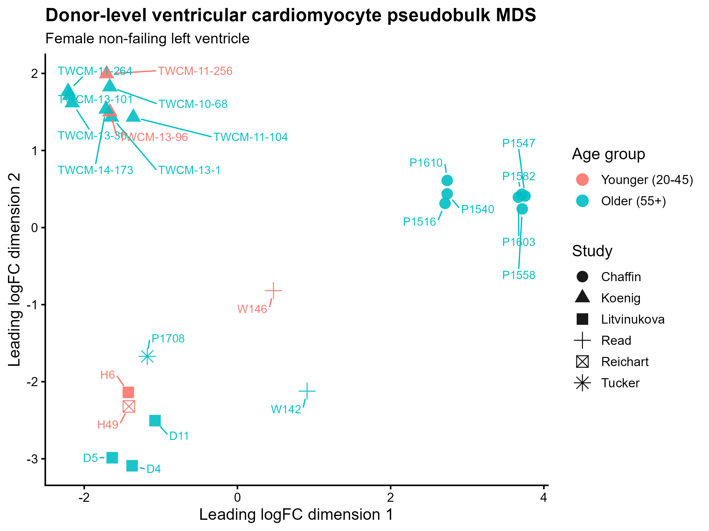
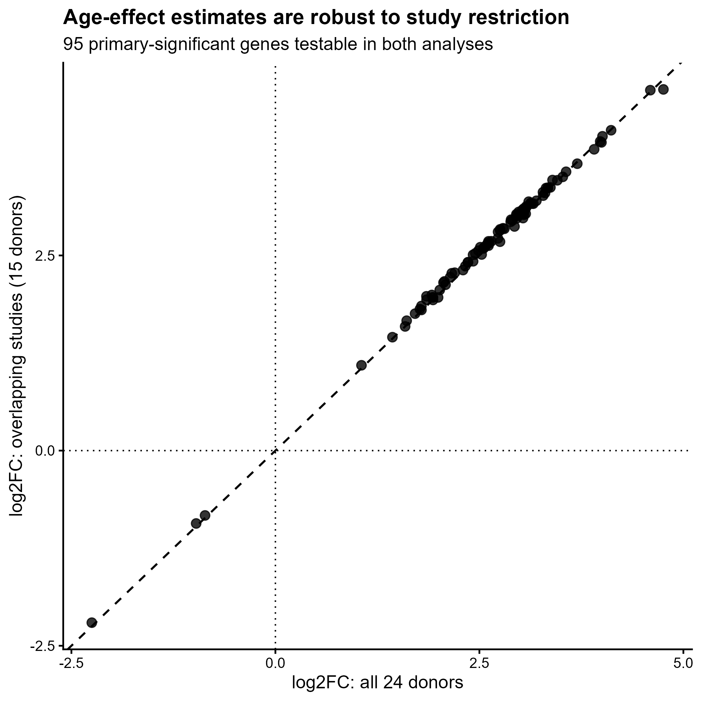
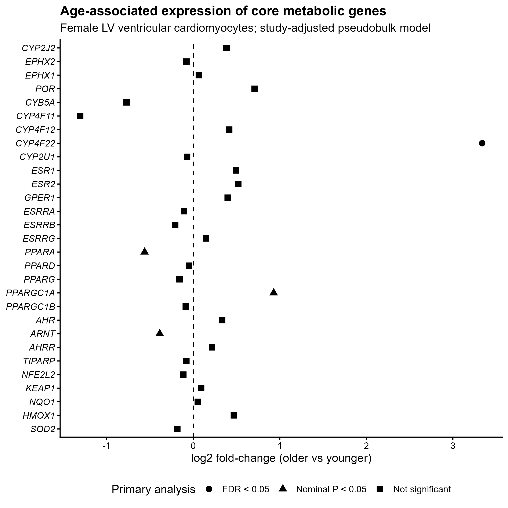
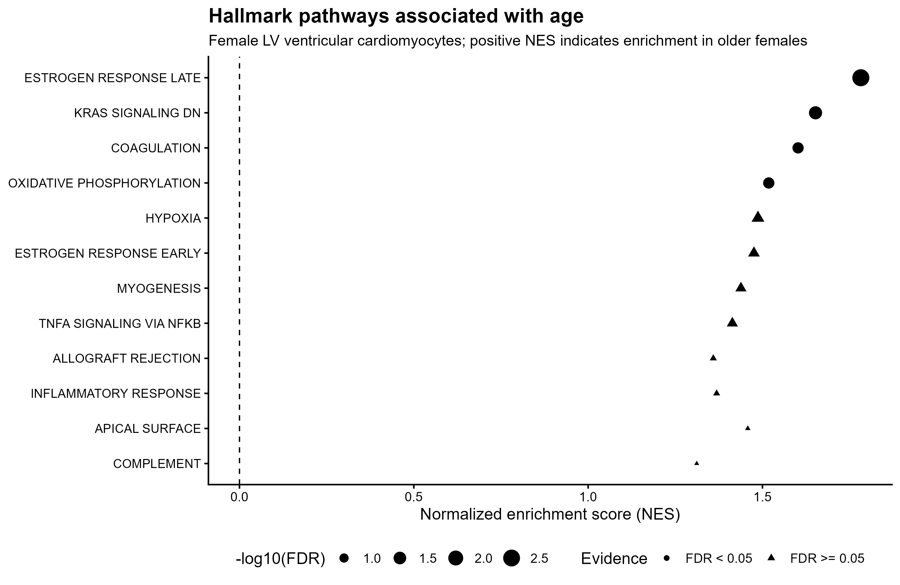
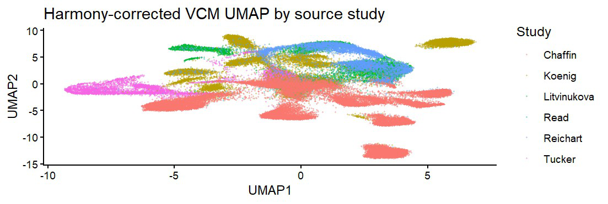
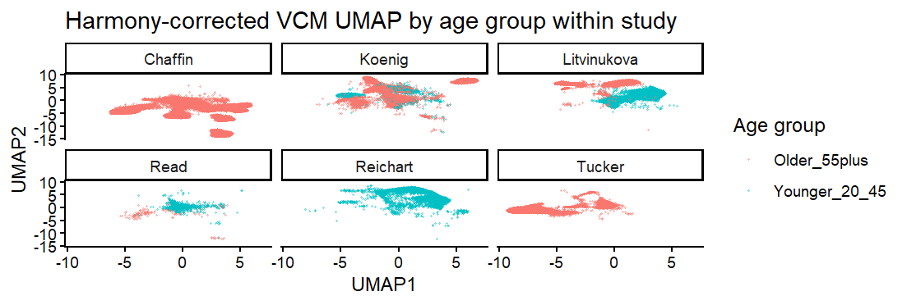

# Age-associated transcriptional programs in female human LV ventricular cardiomyocytes

Computational reanalysis of the human-heart single-nucleus RNA-seq meta-analysis from **Read et al. (2024)** to identify transcriptional programs that distinguish ventricular cardiomyocytes from younger and older female donors in the non-failing left ventricle.

**Author:** Mostafa Abd El-aziz

## Biological question

> What transcriptional programs distinguish ventricular cardiomyocytes from younger (20–45 years) and older (≥55 years) female donors in the non-failing human heart, with particular emphasis on CYP-mediated metabolism, estrogen-associated signaling, and arachidonic-acid/eicosanoid pathways?

The older group is an **age-based/postmenopausal-age proxy**. Menopausal status, circulating estradiol, and hormone-replacement therapy were not available in the source metadata; therefore this repository does not treat age ≥55 as confirmed menopause.

## Source dataset

Read DF et al. **Single-cell analysis of chromatin and expression reveals age- and sex-associated alterations in the human heart.** *Communications Biology* 7, 1052 (2024).  
DOI: **10.1038/s42003-024-06582-y**

The analysis uses the authors' harmonized multi-study snRNA-seq data and donor metadata. Raw/processed source files are intentionally **not committed** to this repository.

## Primary cohort

- Female donors only
- Non-failing heart
- Left ventricle (LV)
- Ventricular cardiomyocytes (VCMs)
- Younger: 20–45 years
- Ages 46–54 excluded
- Older: ≥55 years
- Primary cohort: **24 donors (5 younger, 19 older)**
- QC-passing VCM nuclei: **70,364**

The age distribution is imbalanced across source studies. The primary donor-level model therefore adjusts for `DataSource`, and a sensitivity analysis is restricted to studies containing both age groups.

## Analysis overview

```text
Published human-heart atlas
        |
        v
Donor metadata + cohort definition
        |
        v
Female -> LV -> ventricular cardiomyocytes
        |
        v
Donor-aware per-nucleus QC
        |
        v
Normalization + 2,000 HVGs
        |
        v
Sparse PCA -> unintegrated UMAP
        |
        v
Assess source-study effects
        |
        v
Harmony correction by DataSource only
        |
        v
Exploratory Leiden neighborhoods
        |
        v
RAW counts aggregated by donor
        |
        v
edgeR pseudobulk: ~ DataSource + age_group
        |
        +--> overlapping-study sensitivity analysis
        |
        +--> targeted CYP / estrogen / eicosanoid genes
        |
        +--> Hallmark / Reactome / GO-BP preranked GSEA
        |
        v
Biological interpretation + limitations
```

## Key statistical principle

The **donor is the biological replicate**, not the nucleus. The DE analysis therefore aggregates raw counts from all QC-passing VCM nuclei belonging to the same donor into one pseudobulk library before fitting edgeR models.

Primary design:

```r
design <- model.matrix(
  ~ DataSource + age_group,
  data = dge$samples
)
```

Positive log2 fold-change corresponds to higher expression in the older group.

## Main findings from the current analysis

- 15,282 genes were tested in the primary pseudobulk model.
- 111 genes reached FDR < 0.05:
  - 108 higher in older females
  - 3 higher in younger females
- `CYP4F22` was the strongest targeted CYP-related FDR-significant signal and retained a nearly identical effect estimate in the overlapping-study sensitivity analysis.
- Among the 95 primary-significant genes that remained testable in the overlapping-study sensitivity cohort:
  - 95/95 retained the same direction
  - Pearson correlation of log2FC ≈ 0.999
- Unbiased Hallmark GSEA identified older-enriched programs including:
  - Estrogen response late
  - KRAS signaling DN
  - Coagulation
  - Oxidative phosphorylation
- Reactome analysis supported younger enrichment of PPARα-regulated lipid metabolism.
- Broad arachidonic-acid/eicosanoid pathway enrichment was suggestive in places but did not support a blanket claim of global pathway activation.

These results support **age-associated transcriptional remodeling** in female LV VCMs. They do not establish a causal effect of menopause or estrogen loss.
## Key figures

### Donor-level pseudobulk structure



**Figure 1. Donor-level pseudobulk MDS.**  
Multidimensional scaling of donor-level pseudobulk ventricular cardiomyocyte profiles. This visualization is used to assess major sources of between-donor transcriptional variation, including age group and source-study structure. Differential expression was therefore performed at the donor level with source study included as a covariate in the primary model.

---

### Robustness of age-associated transcriptional effects



**Figure 2. Concordance of age-associated effect sizes between the primary and sensitivity analyses.**  
Log2 fold-change estimates from the primary analysis (24 donors; study-adjusted) are compared with estimates from the overlapping-study sensitivity analysis (15 donors from Koenig, Litvinukova, and Read). Among primary-significant genes that remained testable in the sensitivity analysis, effect directions were highly concordant. This analysis evaluates effect-size robustness rather than independent FDR replication.

---

### CYP, estrogen-associated, and eicosanoid-related transcriptional signals



**Figure 3. Selected mechanistically relevant genes.**  
Age-associated transcriptional effects for genes related to CYP-mediated metabolism, estrogen-associated signaling, and arachidonic acid/eicosanoid biology. Positive log2 fold changes indicate higher expression in older (≥55 years; postmenopausal-age proxy) female donors. CYP4F22 emerged as the clearest individual CYP-associated signal, whereas the results do not support a general conclusion of global CYP/eicosanoid pathway activation.

---

### Genome-wide pathway enrichment



**Figure 4. Hallmark gene-set enrichment analysis.**  
Genome-wide GSEA identified significant enrichment toward older female donors for late estrogen response, oxidative phosphorylation, coagulation, and KRAS signaling DN. Pathway-level results support coordinated age-associated transcriptional remodeling beyond individual differentially expressed genes.
### Additional dimensionality-reduction views

#### Harmony UMAP by source study



Harmony was applied to `DataSource` only to reduce source-study structure for visualization and neighborhood analysis. Age group was not included as a correction variable, and Harmony coordinates were not used for pseudobulk differential expression.

#### Harmony UMAP by age group and study



This view illustrates the distribution of younger and older female VCM nuclei across the Harmony-corrected embedding while retaining study context. It is used as a visualization of cell-level structure rather than as evidence for donor-level age effects.
## Repository structure

```text
.
├── README.md
├── CITATION.cff
├── .gitignore
├── data_raw/
│   └── README.md
├── data/
│   └── README.md
├── docs/
│   ├── METHODS.md
│   └── RESULTS_SUMMARY.md
├── results/
│   ├── tables/
│   ├── figures/
│   └── enrichment/
└── scripts/
    ├── install_packages.R
    ├── run_all.R
    ├── 01_metadata_cohort.R
    ├── 02_load_expression_data.R
    ├── extract_female_LV_VCM.py
    ├── 03_VCM_QC_preprocessing.R
    ├── 04_VCM_pseudobulk_age_DE.R
    └── archive/
        └── original uploaded scripts
```

## Reproducing the analysis

### 1. Clone the repository


```bash
git clone https://github.com/Mokhaled576/female-LV-VCM-aging.git
cd female-LV-VCM-aging
```

### 2. Install packages

From R:

```r
source("scripts/install_packages.R")
```

### 3. Download the required source data

See [`data_raw/README.md`](data_raw/README.md). Do not commit the large source files to Git.

### 4. Run scripts in order

```r
source("scripts/01_metadata_cohort.R")
source("scripts/02_load_expression_data.R")
source("scripts/03_VCM_QC_preprocessing.R")
source("scripts/04_VCM_pseudobulk_age_DE.R")
```

`02_load_expression_data.R` calls the Python helper to extract the required VCM columns from the full Matrix Market file. This can take substantial time and disk I/O.

The `scripts/run_all.R` driver is provided for a clean environment, but running the scripts separately is recommended during development because Scripts 02–03 are computationally intensive.

## Important implementation notes

- The large count matrix is kept **sparse**. Do not call `as.matrix()` on the complete VCM matrix.
- PCA is performed with `irlba::prcomp_irlba()` on the sparse HVG matrix.
- Harmony is applied to **source study (`DataSource`) only** for visualization/neighborhood analysis.
- **Age group is never integrated/corrected away.**
- Differential expression uses raw donor-level pseudobulk counts, not Harmony values or integrated expression.
- Mitochondrial percentage is retained as a diagnostic but is not used as a final exclusion rule because mitochondrial counts are extremely low in this snRNA-seq dataset.
- Leiden clusters are exploratory because residual source-study structure remains after Harmony.

## Sensitivity analysis

Because study and age are partially confounded, the primary result is checked in the three studies containing both age groups:

- Koenig
- Litvinukova
- Read

This produces a 15-donor sensitivity cohort (4 younger, 11 older). `filterByExpr()` and the complete edgeR model are rerun within this restricted cohort.

Loss of FDR significance in the smaller cohort is interpreted together with effect-size and directional concordance rather than as a binary replication/failure criterion.

## Experimental extension

This computational analysis can serve as the **human discovery/translational arm** of a larger project testing estrogen-dependent CYP dysregulation in cardiomyocyte models such as AC16 and RL14 cells. Any experimental extension should distinguish an estrogen-depleted/replete culture model from confirmed human menopause and should ideally connect transcript/protein changes to a functional or metabolic phenotype.

## Citation

If you use this repository, please cite the source study and this analysis repository. See [`CITATION.cff`](CITATION.cff).

## License

The analysis code in this repository is released under the [MIT License](LICENSE).

The original human-heart snRNA-seq data remain subject to the terms, licenses, and usage conditions of the source study and its associated repositories.